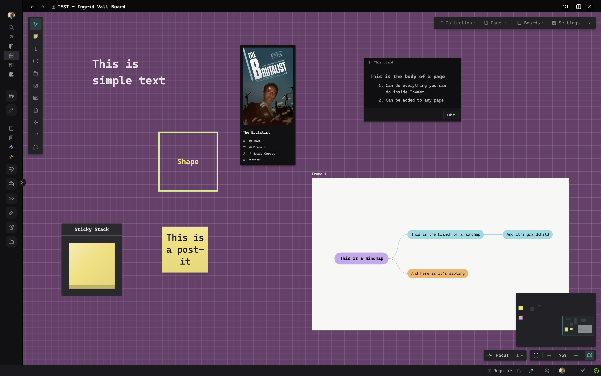
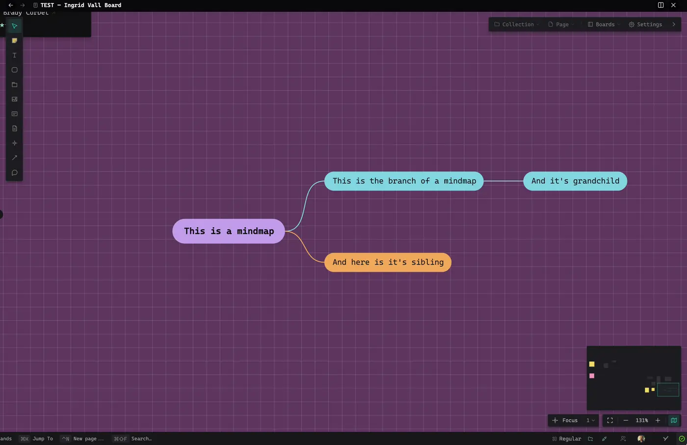
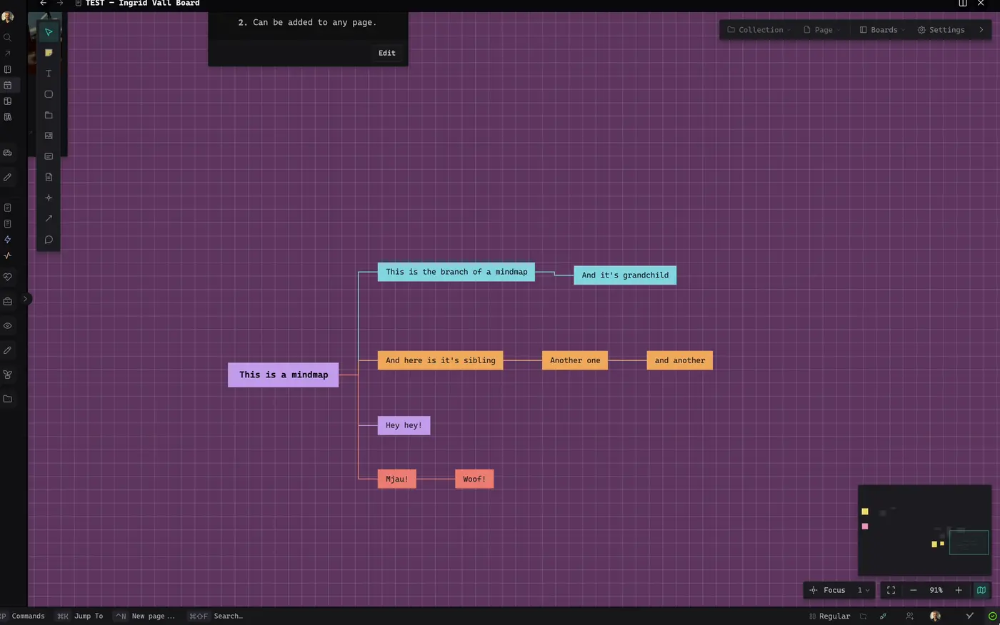
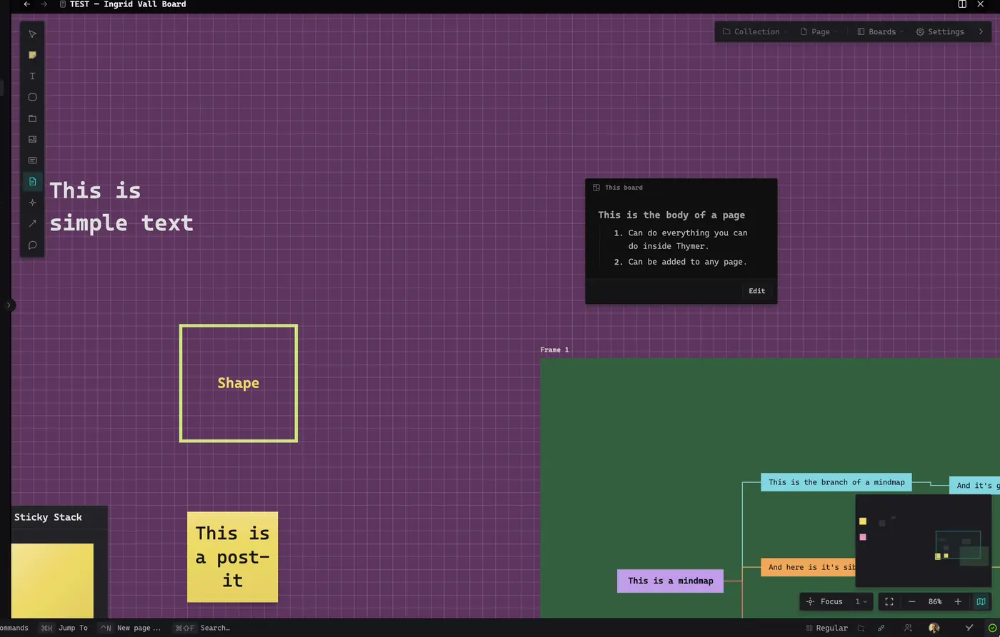
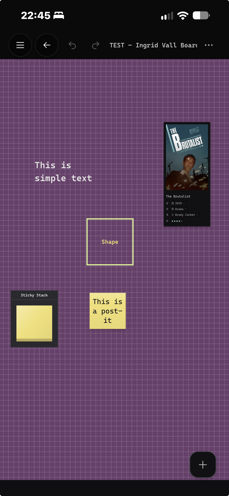

# Whiteboard

Whiteboard is a [Thymer](https://thymer.com) plugin that gives you an infinite canvas inside your workspace. Put post-its, text, shapes, images and mind maps on a board, connect anything to anything, and bring your own Thymer pages onto the canvas as real cards: their properties stay editable right on the board, and a note card is a live piece of a page that you write in directly. Boards are ordinary pages in a Boards collection, so they can belong to any page or collection, and they sync between your devices while you work.

## What you can put on a board

- **Post-its** in twelve paper colours, square or wide. Type straight onto them; the text sizes itself to fit. A **sticky stack** hands out fresh post-its in its colour: drag one off the pad.
- **Text** and **shapes** (rectangle, rounded, ellipse, diamond, pill, triangle, arrow). Drag with the Shape tool to draw one at the size you want. A shape without a fill is an outline you can put around other things.
- **Frames**: named areas that carry everything inside them when you move them.
- **Images**: drop or paste them onto the board, resize freely.
- **Link cards**: paste a web address and get a card with the page's title, description and image.
- **Pages as cards**: any page from any collection, drawn as Thymer's own board or gallery card. Pick which properties show and edit them on the card.
- **Note cards**: a real Thymer editor on the board. A card can live on the board itself, be sent to any page as body content, or show the whole body of an existing page. Edit it on the board and the page changes with it.
- **Mind maps**: horizontal, top-down, org chart or free layout. Tab adds a child, Enter a sibling, every branch gets its own colour, and branches can be dragged, reordered and moved between maps.
- **Relations** between any two things: curved, straight or elbow, solid, dashed or dotted, with arrowheads, labels, bends and thickness. Drag from an element's side dot to empty space to create the next element already connected.
- **Comments** and **tags** on the board, and **sub-boards** you can open like folders.

## Working on a board

The tool rail on the left: **V** Select, **N** Sticky, **T** Text, **S** Shape, **F** Frame, **I** Image, **K** Card, **P** Page, **M** Mind map, **L** Connect, **C** Comment.

- Pan with the trackpad or by dragging with Space held; zoom with pinch or Cmd + scroll. **Shift+1** fits everything on screen.
- Select several things with a drag, then align, distribute or arrange them from the toolbar.
- The **Selection** menu turns things into other things (a post-it into a page, a page card into a note card, a group into a mind map or a sub-board), moves them to another board and changes the stacking order.
- **Cmd+Z** / **Cmd+Shift+Z** undo and redo, **Cmd+C** / **Cmd+V** copy and paste elements, **Cmd+D** duplicates, **Cmd+Shift+L** locks.
- Board settings: dot grid, grid or blank background, a background colour, snap to grid, and a light or dark board that follows Thymer or is set per board. A minimap and a focus mode are in the zoom bar.

## Where boards live

- The first board you make creates a **Boards** collection. Each board is a page there, and the collection gets a **Boards** view that shows all your boards as tiles.
- A board can belong to one or more pages. They are linked both ways: the board lists its pages, and the page gets a **Boards** property with a chip that opens the board.
- A collection can have its own boards, where the collection's pages are placed as cards. Open them from the board icon in the collection's toolbar.
- From the command palette: **Whiteboard: New Board**, **Whiteboard: Find Boards**, **Whiteboard: Add Board for This Page** (on a page) and **Whiteboard: Add Board for This Collection** (in a collection).

## Sync and safety

- A board that is open on two devices shows the other device's changes within a second or two. When both change the board at the same moment, the changes are merged element by element, so nothing either of you added is lost.
- A device saves only once it is in step with the server, so a laptop or phone that was offline for a while can never write an older copy over newer work.
- Every save is also kept on the device. **Board settings > Restore an earlier version** brings back any recent version, and **Export board as JSON** / **Import board from JSON** make a copy you keep yourself.

## On the phone

Boards open on Thymer's phone app with touch controls: one finger pans, two fingers zoom, a long press selects, and the Add button places new elements. Note cards are shown on the phone; editing them works on desktop.

## Installation

1. In Thymer, open the Command Palette (`Cmd+P` / `Ctrl+P`), run **Plugins**, and click **Create Plugin** under Global Plugins.
2. In the plugin's dialog, go to the code editor (click **Edit as Code** if you see the settings view).
3. In the **Custom Code** tab, replace the contents with [`plugin.js`](plugin.js).
4. In the **Configuration** tab, replace the contents with [`plugin.json`](plugin.json).
5. Click **Save**, then run **Whiteboard: New Board** from the command palette.

### What it adds to your workspace

- A **Boards** collection (created with your first board) with the fields Scene, Page, Revision and Mirrors, and a **Boards** view on it.
- A **Boards** property on the collections of pages you attach boards to.
- A hidden collection called **Whiteboard sync**, holding one record the plugin writes to when it needs Thymer to finish a sync round before a save. It does not show in the sidebar or the command palette.

### Link previews

Link cards get their title, description and image from [microlink.io](https://microlink.io), because Thymer cannot read other websites directly. The address you paste is sent to microlink.io once, when the card is made; nothing else is.

## How it's built

Whiteboard is written from scratch in plain DOM and SVG, with no canvas library and no dependencies. That is deliberate: the board is made of regular elements, so Thymer's own pieces can live on it. Page cards are drawn by Thymer's own card renderer, and note cards are Thymer's real editor. Relations are SVG, and a small 2D canvas is used only for the minimap and the board previews in the Boards view. A board is saved as one JSON scene file in its page, in a format loosely modelled on [JSON Canvas](https://jsoncanvas.org), the open format from Obsidian.

## Feedback

This is the first public release. Ideas, questions and bug reports are very welcome in [Issues](../../issues). For anything to do with saving or sync, **Board settings > Copy diagnostics** gives a short report that helps a lot.

## Support

Whiteboard is free. If it has earned a place in your workspace and you would like to say thanks, you can [buy me a coffee](https://buymeacoffee.com/parhamshafti).

## License

[MIT](LICENSE)
